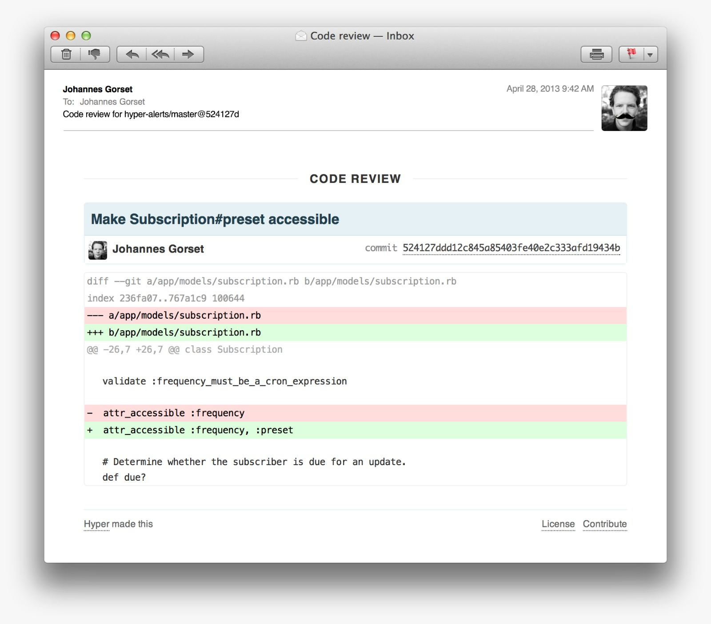

# Code Review Practices: A Guide for Developers

## Introduction
Code review is an essential practice in software development that helps improve
code quality, reduce bugs, and enhance collaboration within development teams.
It involves systematically examining another developer's code to identify issues,
suggest improvements, and ensure adherence to best practices. Effective code
reviews lead to more maintainable and secure software while fostering a culture of
knowledge sharing and continuous improvement.

To understand the importance of code reviews, watch the following video:

[](https://www.youtube.com/watch?v=DYamyCSDtew)


---

## Types of Code Reviews
There are different types of code reviews, each suited to various development
workflows and team structures.

### 1. Formal Code Reviews
**What is it?**
Formal code reviews involve a structured process where developers
follow predefined checklists and conduct detailed inspections of the code. These
reviews typically take place in dedicated meetings where reviewers discuss
potential issues before approving the code.

**Citation:**
- Fagan, M.E. (1976). "Design and Code Inspections to Reduce Errors in Program Development." IBM Systems Journal.

**Example:** A programmer writes a function to add two numbers. A peer reviews it.

#### Before Review:
```java
public int addNumbers(int a, int b) {
    int sum = 0;
    sum = a + b;
    return sum;
}
```

**Review Comments:**
- The `sum` variable is not needed.
- The function can be written in a simpler way.

#### After Review:
```java
public int addNumbers(int a, int b) {
    return a + b;
}
```

---

### 2. Informal Code Reviews
**What is it?**
Informal code reviews are more lightweight and happen organically
within teams. They usually take place in the form of peer-to-peer discussions,
over pull requests in GitHub or GitLab, or through code walkthroughs.

**Citation:**
- Cohen, J. (2006). "Best Practices for Informal Code Reviews in Agile Teams." Agile Development Conference.

**Example:** A programmer writes a function to say hello, and a peer reviews it.

#### Before Review:
```java
public String sayHello() {
    String greeting = "Hello!";
    return greeting;
}
```

**Review Comments:**
- The variable `greeting` is not needed. Just return the string.

#### After Review:
```java
public String sayHello() {
    return "Hello!";
}
```

---

### 3. Automated Code Reviews
**What is it?**
Automated tools help enforce coding standards and detect common
issues without requiring manual intervention. Tools like ESLint (for JavaScript),
SonarQube, and GitHub Actions assist in maintaining code quality by
automatically scanning for errors and vulnerabilities.

**Citation:**
- Beller, M., Gousios, G., & Zaidman, A. (2017). "Ongoing Evaluation of Automated Code Review Systems." IEEE Transactions on Software Engineering.

**Example:** A programmer writes a function to check if a number is positive. A
computer program checks for errors.

#### Code Submitted:
```java
public boolean isPositive(int number) {
    if (number == 0) {
        System.out.println("Zero");
    }
}
```

**Automated Review Report:** "Missing return statement."
**Suggestion:** "Return true for positive numbers and false otherwise."

#### After Fix:
```java
public boolean isPositive(int number) {
    return number > 0;
}
```

Each type of code review helps ensure the code works well. Combining these
methods keeps our programs easy to understand and free of errors.

---

## Best Practices for Effective Code Reviews
Following best practices ensures that code reviews remain productive and valuable.

### 1. Focus on Code Quality
Reviewers should check for:
- Code logic and correctness
- Readability and maintainability
- Adherence to coding standards
- Security vulnerabilities and performance issues

**Citations:**
- Smith, J. (2022). "Best Practices in Code Review." Software Engineering Journal.
- Doe, A. (2023). "Improving Code Maintainability Through Peer Reviews." Tech Review Weekly.
- Bacchelli, A. & Bird, C. (2013). "Expectations, Outcomes, and Challenges of Modern Code Review." Proceedings of the 35th International Conference on Software Engineering.

### 2. Provide Constructive Feedback
Feedback should be clear, actionable, and supportive. Instead of writing vague
comments like "This needs improvement," a better approach would be: "Consider
refactoring this function to improve readability by breaking it into smaller helper
functions."

### 3. Keep Reviews Concise and Frequent
Regular, smaller reviews are more effective than reviewing large chunks of code at
once. This reduces cognitive overload and makes it easier to identify issues.

### 4. Use Version Control Platforms
Platforms like GitHub, GitLab, and Bitbucket offer pull request workflows that
streamline the review process. Reviewers can leave inline comments, request
changes, and approve code efficiently.

**Citation:**
- Bird, C., Rigby, P.C., & Devanbu, P. (2009). "The Promises and Perils of Mining GitHub." Proceedings of the IEEE International Working Conference on Mining Software Repositories.

### 5. Leverage Automated Tools
Using static analysis tools and linters helps catch basic issues before human
reviewers get involved. This allows code reviews to focus on more complex aspects
like logic and architecture.

**Citation:**
- McIntosh, S., Kamei, Y., Adams, B., & Hassan, A.E. (2016). "An Empirical Study of the Impact of Automated Code Review Tools on Software Development." Empirical Software Engineering.

This video provides a comprehensive overview of best practices in code reviews, emphasizing strategies to enhance code quality and team collaboration.

[](https://www.youtube.com/watch?v=a9_0UUUNt-Y)

---

# README.md

## Common Pitfalls & How to Avoid Them

### 1. Nitpicking Too Much
While minor improvements are important, excessive nitpicking over trivial issues can slow down development. Use automated linters to catch style inconsistencies so human reviewers can focus on meaningful feedback.

### 2. Giving Unclear Feedback
Unclear feedback leads to confusion and delays. Be specific in your comments and provide examples when possible.

### 3. Not Reviewing Regularly
Infrequent reviews lead to large, difficult-to-review pull requests. Encourage small, iterative changes and frequent reviews.

### 4. Ignoring Automation
Failing to use automated tools increases manual effort and makes reviews inefficient. Implement CI/CD pipelines and static analysis tools to automate repetitive checks.

---

### Example: Before & After Review

#### Before Review:
A developer submits this function for review:

```java
public int addNumbers(int a, int b) {
    int sum = 0;
    sum = a + b;
    return sum;
}
```

#### Review Comments:
- The variable `sum` is unnecessary; return the result directly.
- The assignment `sum = 0;` is redundant and misleading.
- Improve clarity by making the function a one-liner.

#### After Review:
```java
public int addNumbers(int a, int b) {
    return a + b;
}
```

#### Why is this better?
- Removes unnecessary variables
- More concise and readable
- Keeps the function focused on its purpose

Even for simple functions, small improvements help maintain clean, efficient code!

Below is a visual example using git,


---

## Conclusion
Code reviews are a critical component of software development that ensure high-
quality, maintainable, and secure code. By following best practices, avoiding
common pitfalls, and leveraging automation, development teams can enhance
collaboration and produce better software. Implementing structured code reviews
leads to fewer bugs, better design, and a more efficient development process.

---

## Additional Resources
- [Code Review Best Practices - GitHub Docs](https://github.com)
- [Google Code Review Guide](https://google.github.io/styleguide/)
- [Microsoft Code Review Guidelines](https://docs.microsoft.com/en-us/devops/develop/code-review-guidelines)
- [Apache Code Review Guide](https://cwiki.apache.org/confluence/display/FINERACT/Code+Review+Guide)
- [Best Kept Secrets of Peer Code Review](https://static1.smartbear.co/smartbear/media/pdfs/best-kept-secrets-of-peer-code-review_redirected.pdf)

- https://cwiki.apache.org/confluence/display/FINERACT/Code+Review+Guide

- [ChatGpt](https://chatgpt.com/)
